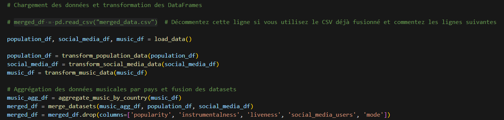
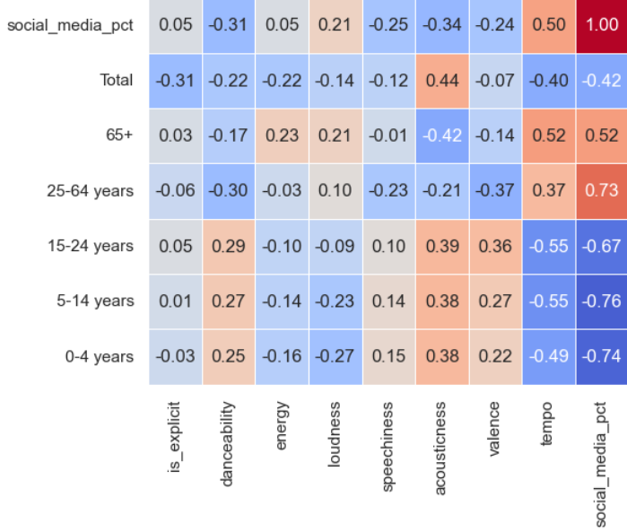
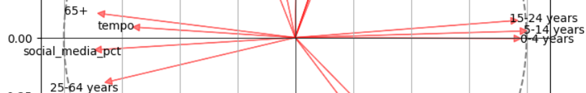
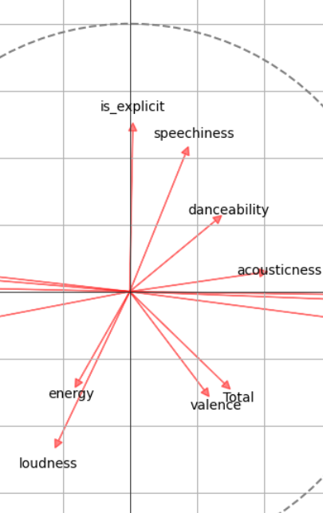
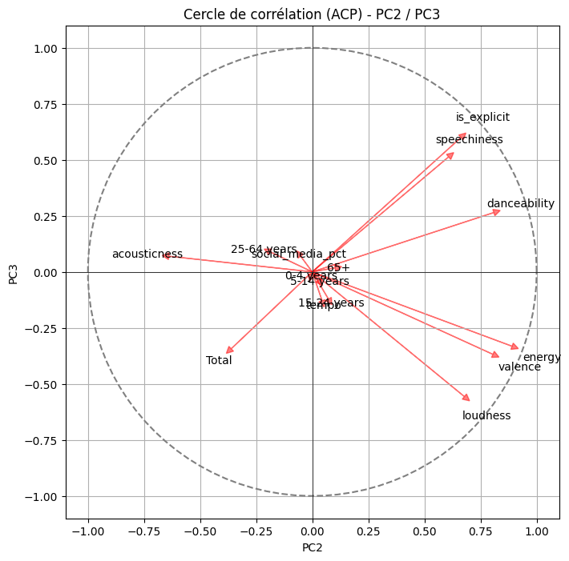
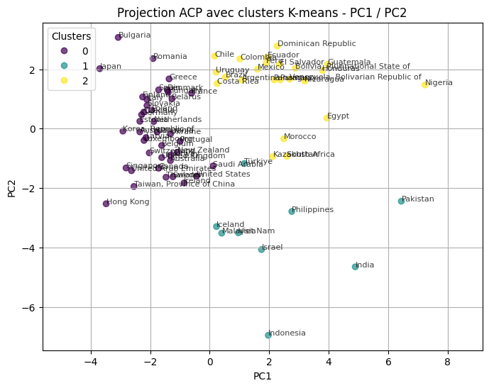
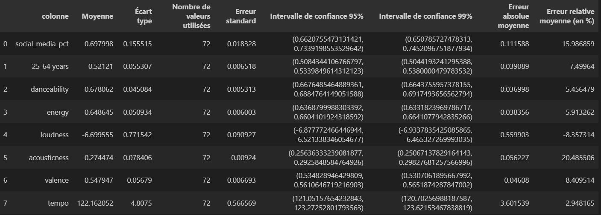

# Data centric
## Contexte du projet
L'objectif de ce projet est d'utiliser différentes sources d'informations pour analyser des données musicales, démographiques et de tendances sociales.\
L'approche est centrée sur les données et vise à croiser plusieurs jeux de données afin de mieux comprendre les préférences musicales à travers des caractéristiques démographiques et de l'usage des réseaux sociaux.

## Sommaire
- Prérequis
- Participants au projet
- Problématique abordée
- Sources de données choisies
- Fusion des données
- Analyse en composante principale
- Cercle de correlation
- Méthode de clustering
- Erreurs et intervalles de confiance
- Technologies utilisées

---

### Prérequis
Afin de lancer le projet, vous devez avoir une version récente de Python (idéalement Python 3.12) avec plusieurs librairies installées:
- Pandas
- Matplotlib
- Numpy
- Sklearn
- Pycountry
- Itertools
- Seaborn

Vous devez aussi avoir les différents fichiers CSV nécessaires dans le même dossier que le fichier .ipynb que vous devrez lancer.
1. 1ère option pour les CSV:
   Avoir les 3 csv: population_by_age_group, social-media-users-by-country-2025 et spotify_top_songs.

2. 2ème option pour les CSV
   Étant donné que le CSV spotify_top_songs est plutôt lourd, vous pouvez utiliser seulement le fichier merged_data.csv si vous le souhaitez.
   Pour cela:
   - Placez le dans le même dossier que votre notebook
   - Décommentez la ligne : merged_df = pd.read_csv("merged_data.csv")
   - Et décommentez les lignes suivantes dans le même bloc que la ligne précedente (cf. image)
  
 

---

### Participants au projet
- Yannick Boyer (M2 AL)
- Robin Peignet (M2 AL)

---

### Problématique abordée
Nous avons choisi d'élaborer une analyse de données autour du thème de la musique et des réseaux sociaux.

L'objectif est d'établir des liens logiques entre les tendances musicales, les caractéristiques démographiques (notamment la répartition par tranche d’âge) et l’utilisation des réseaux sociaux dans différents pays.

---

### Sources de données choisie
Données musicales :
https://www.kaggle.com/datasets/asaniczka/top-spotify-songs-in-73-countries-daily-updated

Données démographiques :
https://www.kaggle.com/datasets/elmoallistair/population-by-age-group-2021

Part de la population active sur les réseau sociaux : 
https://worldpopulationreview.com/country-rankings/social-media-users-by-country#top-10-countries-with-the-most-social-media-users

---

### Fusion des données

**1. Prétraitement**  
- Calcul de la proportion de chaque tranche d'âge par pays
- Nettoyage des colonnes et renommage harmonisé
- Harmonisation des noms de pays entre les datasets

**2. Caractéristiques musicales**  
Pour chaque pays, nous avons calculé la moyenne des caractéristiques musicales (ex: danceability, energy, tempo…) des morceaux présents dans le top 50.

**3. Fusion des jeux de données**  
Les jeux de données ont été fusionnés sur la colonne `country`.

> Le résultat est un dataset consolidé, où chaque ligne représente un pays, enrichi par :
> - des données démographiques (répartition par tranche d'âge)
> - le pourcentage d’utilisateurs actifs sur les réseaux sociaux
> - la moyenne des caractéristiques musicales issues du top Spotify

---

### Analyse des données

Dans notre analyse des données, on retrouve :
- Une distribution des caractéristiques musicales
- Une matrice de corrélations entre données démographiques, réseaux sociaux et données musicales

Dans cette matrice, on peut s'intéresser à cette partie dans laquelle on retrouve les potentielles correlations entres ces 3 types de données (on enlève par exemple les corrélation des données musicales entre elles : danceability/tempo, etc.).

On observe par exemple que les pays avec un plus grand total d'habitants écoutent plus des musiques accoustiques, ou encore que les pays avec une forte population de 25-64 ans se retrouvera plus sur les réseaux sociaux.

### Analyse en composantes principales

Nous appliquons une ACP (Analyse en Composantes Principales) afin de :
- Réduire la dimension des données tout en conservant l’essentiel de l’information
- Trouver la variance expliquée par composante principale
- Visualiser les liens entre les variables et les pays
- Identifier des groupes de pays aux profils similaires

On obtient comme résultat pour les variances:
- Variances expliquées : 
  - PC1: 0.38519082
  - PC2: 0.26018473 
  - PC3: 0.09311919
- Variance cumulée : 0.7384947392621364

On voit donc que PC1 et PC2 ont un fort impact sur la variance. Nous avons donc majoritairement axé notre analyse sur ces deux composantes, tout en gardant PC3 qui a un impact non négligeable sur la variance.

Grâce à cette analyse en composantes principales, on commence à observer des groupes de pays qui se forment en fonction de PC1, PC2 et PC3.\
Mais il est pour le moment difficile d'expliquer ces potentielles corrélations.

---

### Cercle de corrélation

Le cercle de corrélation permet de visualiser la contribution de chaque variable initiale dans la construction des composantes principales. Cela nous aide à interpréter les axes et à comprendre quelles caractéristiques (musicales, démographiques ou sociales) dominent dans l’analyse.

Avant d'analyser les résultats obtenus, il est inmportant de comprendre comment fonctionne un cercle de corrélation.

**1. L'unité de mesure**  
Le cercle (de rayon 1) représente l'ensemble des variables normalisées. Une variable dont le vecteur atteint la périphérie est alors bien représentée par les composantes de ce graphique.

**2. Interprétation des flèches**  
Chaque flèche représente une variable originale. L’angle que forment deux flèches indique leur corrélation :
- Plus l'angle entre les flèches est aigu (< 90°), plus cela signifie une corrélation positive forte.
- Si elles sont opposées (angle proche de 180°), c’est une corrélation négative.
- Un angle d'environ 90° indique peu ou pas de corrélation entre ces variables.

**3. Longueur des flèches**  
Plus une flèche est longue (en se rapprochant du bord du cercle), plus la variable est bien représentée par le plan défini par les deux composantes. Si elle reste vers le centre, elle est moins bien expliquée par ces axes.

Analyse des résultats :
- PC1 semble augmenter lorsque la proportion de population de moins de 24 ans augmente. A contrario, PC1 a une corrélation négative avec la proportion de 25-64 ans et +65 ans. PC1 semble donc représenter les pays avec une moyenne d'âge (et un age médian) plus faible, qui correspondent aux pays en voie de développement. Ce qui peut s'expliquer par un fort taux de natalité, une faible espérance de vie, etc.\
  

- PC2 et PC3 semblent quant à eux corrélés à des données musicales, on retrouve notamment is_explicit, qui correspond au caractère vulgaire d'une musique, le taux de parole (speechiness) ou encore l'énergie de la musique. Ces 2 composantes principales ont de nombreux points communs mais aussi quelques différences. Selon notre analyse, PC2 représenterait plutôt le caractère positif d'une musique alors que PC3 augmenterait plutôt en fonction de l'humeur négative de la musique. \
  
  

- On voit d'ailleurs que la relation entre PC2 et PC3 est assez complexe mais des caractères comme l'energy ou la valence (positivité de la musique) influent positivement sur PC2 mais négativement sur PC3:\
  

---

### Méthode de clustering

Afin de regrouper les pays selon leur profil, nous appliquons des méthodes de clustering, notamment **K-means**, sur les données projetées dans l’espace des composantes principales. Cela permet :
- D’identifier des groupes de pays similaires,
- De visualiser des tendances régionales ou démographiques.

Lorsque l'on regroupe en 3 clusters les différents pays en fonction de PC1 et PC2, on observe très facilement les différents groupes et leurs caractéristiques:
- Dans le groupe 0, on retrouve en haut à gauche (faible PC1 et haut PC2) les pays plus développés, qui ont tendance à écouter des musiques plus dançantes, plus positives. On a donc les pays d'Europe, d'Amérique du Nord, etc.
- Dans le groupe 1, en bas à droite, on peut voir des pays plutôt en voie de développement, écoutant des musiques plus calmes avec une tendance plutôt négative.
- Dans le groupe 2, en haut à droite, il s'agit des pays qui sont aussi en voie de développement mais avec des données musicales plus positives et dançantes dans le Top 50. On retrouve notamment beaucoup de pays d'Amérique du Sud et quelques pays d'Afrique.

---

### Erreurs et intervalles de confiance

Nous avons pris en compte les limitations suivantes :
- Le dataset musical n’est qu’un échantillon du top Spotify, qui ne reflète pas forcément toute la diversité musicale d’un pays.
- Certains noms de pays ont dû être adaptés manuellement lors du prétraitement.
- Les données démographiques datent de 2021, ce qui peut introduire un léger décalage temporel avec les données musicales.
- Beaucoup de pays sont manquants, nous ne travaillons qu'avec 70 pays environ.

Des intervalles de confiance et erreurs ont été calculés sur certaines statistiques pour estimer la robustesse des regroupements observés.

---

### Technologies utilisées

- Python 3.12
- Pandas, NumPy
- Scikit-learn (ACP, K-means)
- Matplotlib, Seaborn
- Jupyter Notebook
- Git / GitHub

---